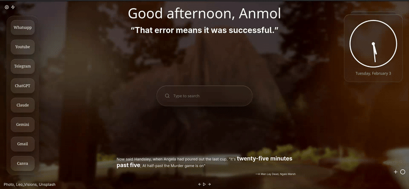

# Tabliss Glass Dock

A clean glassmorphism-style **vertical dock** for the Tabliss new tab extension.  
Inspired by macOS Dock aesthetics.

## ✨ Features

- Glassmorphism blur + depth
- Smooth hover scaling
- Neighbor interaction (macOS-style)
- Lightweight, pure CSS
- Works inside Tabliss custom CSS
- Compatible with ALL Browsers

## 📸 Preview



## 📦 Installation

1.  Open **Tabliss**
2.  Go to **Settings → Advanced → Custom CSS**
3.  Paste contents of `dock.css`
4.  Save & refresh

## ⚙️ Customization

Tweak these variables in `:root`:

```css
--item-w  
--item-h  
--icon-size  
--hover-scale  
--neighbor-scale
```

## *Further you can use your CSS knowledge to add your personality.*
